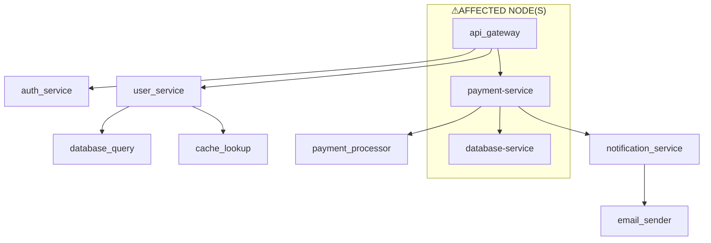

## Executive Summary
The following key findings highlight the critical performance degradation incident in the payment service:
* Critical performance degradation in the payment service due to database connection pool exhaustion and long-running queries.
* A 15% error rate affecting 2,847 transactions, resulting in an estimated loss of $87,500 (Note: Financial impact values are currently hardcoded estimates for demo purposes).
* Increased traffic load and missing query timeout configuration contributed to the connection starvation and cascading failures across the payment service and API gateway.
* Immediate and long-term actions are necessary to prevent similar incidents and ensure the reliability of the payment service.

## Incident Overview
The incident occurred due to critical performance degradation detected in the payment service from telemetry data. According to the narrative field, "Critical performance degradation detected in payment service from telemetry data. Response times increased from 100ms to 3500ms causing transaction timeouts. Analysis shows database connection pool exhaustion with all 50 connections in use, compounded by long-running queries not releasing connections. Customer transactions failed with 15% error rate affecting 2,847 transactions." This degradation resulted in increased response times, causing transaction timeouts and ultimately leading to a significant error rate.

## Root Cause Analysis
The root cause of the incident was database connection pool exhaustion caused by long-running queries not properly releasing connections. The root cause is quoted directly as "Database connection pool exhaustion caused by long-running queries (8.5s average) not properly releasing connections. Missing query timeout configuration combined with increased traffic load (2x normal) led to connection starvation and cascading failures across payment service and API gateway." This root cause analysis highlights the need for proper query timeout configuration and efficient connection management to prevent similar incidents.

## Technical Analysis
The technical analysis of the incident reveals the following error log patterns:
| Timestamp | Service | Message |
| --- | --- | --- |
| 2025-12-07T10:30:00Z | payment-service | Connection pool warning: 45/50 connections in use, pool utilization at 90% |
| 2025-12-07T10:35:00Z | database-service | Slow query detected: SELECT FROM transactions taking 8.5s (normal: 0.2s) |
| 2025-12-07T10:40:00Z | payment-service | Database connection pool exhausted: all 50/50 connections in use |
| 2025-12-07T10:45:00Z | payment-service | Response time SLA breach: P99 latency 3500ms exceeds 500ms threshold |
| 2025-12-07T10:47:00Z | api-gateway | Upstream timeout errors from payment-service: 15% error rate |
The error log patterns show that the payment service experienced a connection pool warning, followed by a slow query detection in the database service. The payment service then exhausted its database connection pool, leading to a response time SLA breach and upstream timeout errors from the API gateway.

## Affected Services
The following services were affected by the incident:
* payment-service: The primary service affected by the incident, experiencing database connection pool exhaustion and response time SLA breaches.
* database-service: The database service was affected by long-running queries, contributing to the connection pool exhaustion.
* api-gateway: The API gateway experienced upstream timeout errors from the payment service, resulting in a 15% error rate.

## Span Topology Diagram
The span topology diagram shows the error propagation across the affected services:

The diagram highlights the affected nodes in the subgraph labeled "⚠︎AFFECTED NODE(S)", which include the API gateway, payment service, and database service.

## Impact Assessment
The incident resulted in a significant business and technical impact. The 15% error rate affecting 2,847 transactions led to an estimated loss of $87,500. The technical impact was characterized by increased response times, connection pool exhaustion, and upstream timeout errors. The incident highlights the need for efficient connection management, proper query timeout configuration, and robust error handling to prevent similar incidents.

## Remediation Actions
To prevent similar incidents, the following remediation actions are recommended:
* Implement efficient connection management and pooling strategies to prevent connection pool exhaustion.
* Configure query timeout settings to prevent long-running queries from holding connections for extended periods.
* Implement robust error handling and retries to minimize the impact of upstream timeout errors.
* Monitor and analyze telemetry data to detect performance degradation and respond promptly to incidents.

## Recommendations
Based on the matched rules and incident analysis, the following strategic recommendations are made:
* Conduct regular performance assessments and capacity planning to ensure the payment service can handle increased traffic loads.
* Implement automated testing and validation of database queries to detect and prevent long-running queries.
* Develop and implement a comprehensive incident response plan to ensure prompt and effective response to similar incidents in the future.
* Continuously monitor and analyze telemetry data to identify areas for improvement and optimize the payment service for reliability and performance.