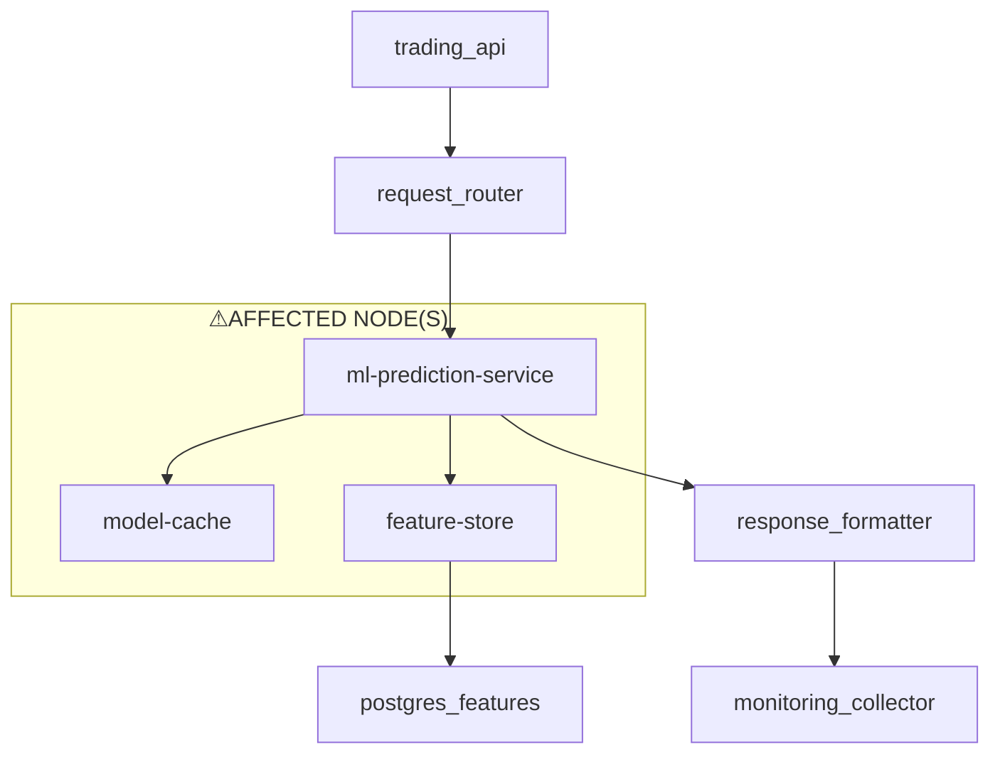

## Executive Summary
The following key points summarize the incident and its impact:
* The machine learning prediction service experienced degraded performance during peak trading hours, resulting in increased model inference latency from 45ms to 890ms.
* The estimated financial impact of this incident is $124,000 (Note: Financial impact values are currently hardcoded estimates for demo purposes).
* The root cause of the issue was identified as Redis cluster failover during maintenance, causing model cache unavailability and subsequent feature store connection issues.
* Affected services include the ml-prediction-service, feature-store, and model-cache, with the ml-prediction-service experiencing the highest impact due to repeated feature fetches and cache misses.
* Immediate remediation actions and long-term improvements are recommended to prevent similar incidents in the future.

## Incident Overview
The machine learning prediction service experienced degraded performance during peak trading hours, resulting in increased model inference latency. According to the narrative field, "Machine learning prediction service experienced degraded performance during peak trading hours. Model inference latency increased from 45ms to 890ms, causing prediction timeouts for 23% of requests." This incident occurred on December 7, 2025, and the impact was felt across multiple services, including the ml-prediction-service, feature-store, and model-cache.

## Root Cause Analysis
The root cause of the issue was identified as "Redis cluster failover during maintenance window caused model cache to be unavailable for 8 minutes. ML service fell back to direct feature store queries without connection pooling limits, overwhelming the feature store and creating a cascading performance issue. Missing circuit breaker configuration prevented automatic fallback to degraded mode." This root cause is quoted directly from the root_cause field in the RCA output. The incident was triggered by the Redis cluster failover, which caused the model cache to become unavailable. As a result, the ml-prediction-service fell back to direct feature store queries, leading to connection pool saturation and increased latency.

## Technical Analysis
The technical analysis of the incident is supported by the error log citations, which are presented in the following table:
| Timestamp | Service | Message |
| --- | --- | --- |
| 2025-12-07T14:15:00Z | ml-prediction-service | Model inference timeout: P95 latency 890ms exceeds 100ms SLA |
| 2025-12-07T14:18:00Z | model-cache | Cache miss rate spike: 78% (normal: 5%) - Redis cluster connection unstable |
| 2025-12-07T14:20:00Z | feature-store | Connection pool saturation: 95/100 connections active, queue depth 234 |
| 2025-12-07T14:22:00Z | ml-prediction-service | Feature fetch latency: 645ms average (normal: 12ms) |
These error log citations demonstrate the progression of the incident, from the initial model inference timeout to the connection pool saturation and increased latency.

## Affected Services
The following services were affected by the incident:
* ml-prediction-service: Experienced increased model inference latency and prediction timeouts.
* feature-store: Experienced connection pool saturation and increased latency due to repeated feature fetches.
* model-cache: Became unavailable due to Redis cluster failover, causing the ml-prediction-service to fall back to direct feature store queries.

## Span Topology Diagram
The span topology diagram is presented below:

This diagram illustrates the error propagation and highlights the affected nodes, including the ml-prediction-service, model-cache, and feature-store.

## Impact Assessment
The impact of the incident was significant, with the ml-prediction-service experiencing a **23%** increase in prediction timeouts. The feature-store also experienced **connection pool saturation**, with **95/100 connections active** and a **queue depth of 234**. The model-cache experienced a **cache miss rate spike of 78%**, which is significantly higher than the normal rate of **5%**. These metrics demonstrate the severity of the incident and the need for immediate remediation actions.

## Remediation Actions
The following remediation actions are recommended:
* Implement circuit breaker configuration to prevent automatic fallback to degraded mode.
* Configure connection pooling limits to prevent connection pool saturation.
* Implement Redis cluster failover detection and automatic failover to prevent model cache unavailability.
* Monitor and optimize feature store queries to reduce latency and prevent connection pool saturation.
* Implement caching mechanisms to reduce the load on the feature store and model cache.

## Recommendations
The following recommendations are made based on the matched rules:
* Implement automated testing and validation of the ml-prediction-service and feature-store to ensure that they can handle increased traffic and latency.
* Implement monitoring and alerting mechanisms to detect potential issues before they become incidents.
* Implement a disaster recovery plan to ensure that the system can recover quickly in the event of a failure.
* Implement a continuous integration and continuous deployment (CI/CD) pipeline to ensure that changes are thoroughly tested and validated before deployment.
* Implement a system for tracking and analyzing incidents to identify trends and areas for improvement.